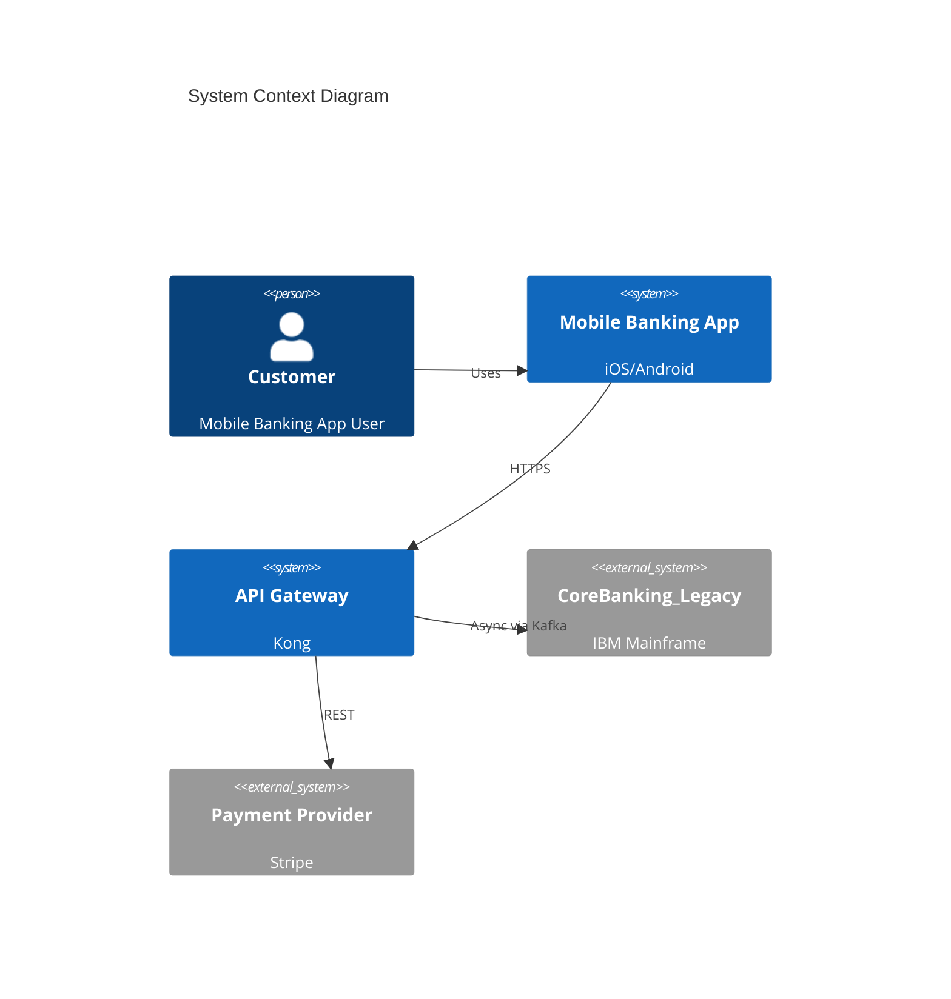
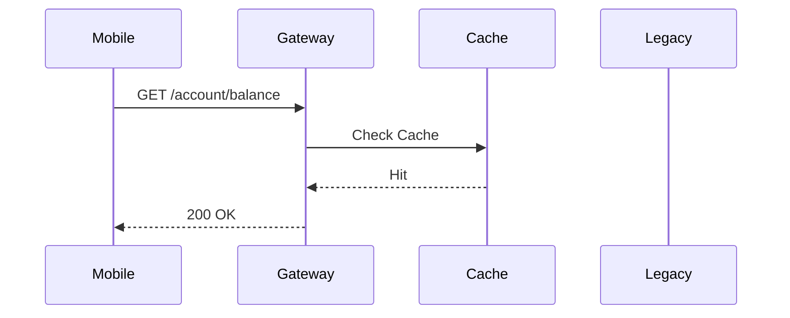

Gute Idee — das wäre der konkreteste Teil des Artikels und gibt echten praktischen Wert. Lass mich kurz die arc42-Struktur gegen die im Artikel bereits etablierten Prinzipien (Progressive Disclosure, layered loading, pointer-based) mappen.Gut — ich habe jetzt alle 12 arc42-Abschnitte im Kopf. Hier ist ein Draft für den tabellarischen/analytischen Teil, den du in den Abschnitt einbauen kannst:

---

Die 12 arc42-Abschnitte lassen sich für agentic coding in drei Gruppen einteilen: **immer laden**, **aufgabenspezifisch**, und **selten bis nie relevant**.

---

**Gruppe 1 — Always-on (Pointer in AGENTS.md)**

Diese Abschnitte sind kurz, stabil, und definieren was der Agent grundsätzlich nicht darf oder muss. Sie gehören als Pointer in AGENTS.md selbst — nicht als vollständiger Inhalt, sondern als Verweis.

| arc42-Abschnitt | Inhalt | Trigger / Relevanz |
|---|---|---|
| **2 — Constraints** | Technische und organisatorische Einschränkungen | Immer. Das sind die harten Verbote. "Keine synchronen Calls an Legacy-Endpoint für neue Mobile-Reads." Dieser Abschnitt ist der direkteste Äquivalent zu den Boundary Conditions in AGENTS.md. |
| **1 — Introduction & Goals** | Top-3 Qualitätsziele, Stakeholder | Immer — aber nur die Qualitätsziele. Kein Prosa-Intro. Der Agent braucht zu wissen: was ist nicht verhandelbar (Performance, Compliance, Availability). |
| **12 — Glossary** | Domänenvokabular | Immer, wenn domänenspezifische Begriffe im Ticket auftauchen. Verhindert, dass der Agent "OverdraftLimit" und "CreditLine" als Synonyme behandelt. |

---

**Gruppe 2 — Aufgabenspezifisch (On-demand, getriggert durch Datei/Modul/Task)**

Diese Abschnitte sind zu groß und zu spezifisch für den globalen Kontext. Der Trigger ist der Code-Bereich, den der Agent berührt.

| arc42-Abschnitt | Inhalt | Trigger |
|---|---|---|
| **3 — Context & Scope** | Externe Systeme, Systemgrenzen, Interfaces | Trigger: Agent berührt externe API-Calls, Integration Layer, oder Event-Topics. "Welche Nachbarsysteme existieren und was versprechen sie?" |
| **5 — Building Block View** | Modulstruktur, Komponenten, Abhängigkeiten (Level 1/2) | Trigger: Agent legt neue Komponente an, refactored Modulgrenze, oder öffnet eine Datei in einem unbekannten Modul. Das ist der Index der Systemstruktur. |
| **6 — Runtime View** | Sequenzdiagramme, kritische Laufzeitszenarien | Trigger: Agent implementiert Flows über Modulgrenzen hinweg, debuggt Interaktionsprobleme. Nicht bei simplen Feature-Tickets. |
| **7 — Deployment View** | Infrastruktur, Umgebungen, Deployment-Targets | Trigger: Agent berührt Konfiguration, Infrastructure-as-Code, CI/CD-Pipeline, oder umgebungsabhängige Logik. |
| **8 — Crosscutting Concepts** | Patterns die überall gelten: Security, Logging, Error Handling, Auth | Trigger: Agent schreibt neuen Service-Code, implementiert Authentication, oder fügt Logging hinzu. Das ist der "Golden Path"-Abschnitt. |
| **9 — Architecture Decisions (ADRs)** | Entscheidungen mit Kontext und verworfenen Alternativen | Trigger: Agent wählt zwischen mehreren technischen Optionen, oder Pattern das er im Code sieht weicht von erwartetem ab. ADRs sind der Constraint-Index. |

---

**Gruppe 3 — Selten relevant für den Agent (Human-facing)**

| arc42-Abschnitt | Warum selten | Ausnahme |
|---|---|---|
| **4 — Solution Strategy** | Hohes Abstraktionsniveau, strategische Entscheidungen. Wertvoll für Onboarding, aber zu diffus für task-spezifischen Kontext. | Relevant wenn Agent eine grundlegende Architekturentscheidung treffen soll — dann aber explizit übergeben, nicht immer laden. |
| **10 — Quality Requirements** | Qualitätsszenarien sind für den Agent nur dann relevant, wenn sie konkrete, testbare Constraints erzeugen. Abstrakte Qualitätsbäume erzeugen keinen operativen Mehrwert. | Wenn daraus konkrete NFRs abgeleitet wurden (z.B. "Response time < 200ms für alle Mobile-Endpoints"), gehört das in Abschnitt 2 (Constraints). |
| **11 — Risks & Technical Debt** | Wertvoll als AI Debt Register — aber nur wenn der Agent explizit angewiesen wird, bekannte Debt-Patterns nicht zu replizieren. Standard arc42 hat hierfür kein Maschinenlesbares Format. | RAD-AI's AI Debt Register ist hier der richtige Ansatz: strukturiert, explizit, nicht Prosa. |

---

Das wäre der Kern des Abschnitts. Für den Artikel selbst würde ich das nicht als Tabelle lassen — eine Tabelle ist zu kompakt und liest sich nicht gut im Fließtext-Kontext des restlichen Artikels. Ich würde das in **drei Absätze** überführen, mit der Dreigliederung als rotem Faden, und die Tabelle als optionalen "Reference"-Block anhängen oder weglassen.

Soll ich das so in Fließtext umschreiben und in den Abschnitt integrieren?

---

## Erweiterte Referenz: Das Dreistufen-Modell im Detail

*Dieser Abschnitt dient als substantielle Grundlage für das finale Kapitel des Artikels und als eigenständige Referenz für Teams, die die Struktur adaptieren möchten.*

---

### 1. Das Dreistufen-Modell: Grundprinzipien

Die 12 arc42-Abschnitte — erweitert um die 8 RAD-AI-Erweiterungen — lassen sich für agentic coding in drei Gruppen einteilen, die unterschiedliche Lade-Triggers, Token-Budgets und Render-Formate haben:

| Stufe | Name | Token-Budget | Trigger | Beispiel |
|---|---|---|---|---|
| **Tier 1a** | Universal (Root AGENTS.md) | ~200-400 Token gesamt | Jede Session | Universelle Constraints, Top-3 Goals, Glossary-Pointer |
| **Tier 1b** | Domain-Specific (Nested AGENTS.md) | ~100-300 Token pro Domäne | Agent bearbeitet Datei im Bereich | Backend-Constraints, Frontend-Constraints |
| **Tier 2** | On-demand (Task-specific) | ~500-2000 Token pro Datei | Agent berührt relevanten Code-Bereich | Building Blocks, Runtime, ADRs |
| **Tier 3** | Reference (Human-facing) | Vollständiger Text | Explizite Anfrage | Solution Strategy, Quality Requirements |

**Empirische Grundlage:** Gloaguen et al. (2026) zeigen in ihrer Evaluation von AGENTS.md-Dateien, dass Kontext-Dateien mit unnötigen Anforderungen die Task-Erfolgsrate *senken* und die Inferenz-Kosten um über 20% erhöhen.[^gloaguen] "Human-written context files should describe only minimal requirements." Dies bestätigt das im Artikel etablierte Prinzip des Progressive Disclosure: Ein ~200-Token-Index, der identifiziert was existiert und wo es zu finden ist, hat mehr Wert als ein 2.000-Token-Dokument, in dem kritische Constraints im Rauschen untergehen.

Gupta et al. (EASE 2026) ergänzen: Context Engineering — nicht Model Scale — ist der dominante Faktor für die Qualität von ADR-Generierung. Ein kleines Recency-Fenster (3-5 vorherige Records) bietet die beste Balance zwischen Qualität und Effizienz.[^gupta]

**Warum die Unterteilung?** Die AGENTS.md-Spezifikation unterstützt verschachtelte Dateien mit Inheritance: der Agent priorisiert immer die Datei, die der editierten Zieldatei am nächsten liegt.[^agentsmd] In einem Monorepo mit `packages/api/` und `packages/frontend/` bedeutet das: ein Frontend-Ticket lädt automatisch die Frontend-AGENTS.md, nicht die Backend-AGENTS.md. Das löst das Problem, das Gloaguen et al. identifizieren — unnötige Anforderungen senken die Erfolgsrate — ohne manuelle Kontext-Auswahl zu erfordern. Constraints sind nicht monolithisch. Sie haben Scope.

---

### 2. Tier 1: Always-on — Der Globale Kontext

Diese Abschnitte definieren, was der Agent grundsätzlich nicht darf oder muss. Aber "immer" bedeutet nicht "alles auf einmal" — Constraints sind domänenspezifisch. Die Lösung nutzt das AGENTS.md Nested-Inheritance-Modell: die Root-AGENTS.md enthält nur universelle Regeln, verschachtelte AGENTS.md-Dateien laden domänenspezifische Regeln nur wenn der Agent im entsprechenden Code-Bereich arbeitet.

Gloaguen et al. (2026) zeigen empirisch: Kontext-Dateien mit unnötigen Anforderungen senken die Task-Erfolgsrate und erhöhen die Inferenz-Kosten um über 20%.[^gloaguen] "Human-written context files should describe only minimal requirements." Das bedeutet: Backend-Regeln in eine Frontend-Session zu laden ist nicht nur verschwenderisch — es ist aktiv schädlich.

#### 2.0 Die Zwei-Sub-Tier-Struktur

| Sub-Tier | Name | Scope | Wo es lebt | Token-Budget |
|---|---|---|---|---|
| **Tier 1a** | Universal Constraints | Projektweit | Root `AGENTS.md` | ~200-400 Token gesamt |
| **Tier 1b** | Domain-Specific Constraints | Modul-/Bereichsspezifisch | Verschachtelte `AGENTS.md` | ~100-300 Token pro Domäne |

Der Agent lädt Tier 1a bei jeder Session. Tier 1b wird automatisch geladen, wenn der Agent eine Datei im entsprechenden Verzeichnis bearbeitet — das AGENTS.md Nested-Inheritance-Modell sorgt dafür, dass der Agent immer die Datei priorisiert, die der editierten Zieldatei am nächsten liegt.[^agentsmd]

#### 2.1 Tier 1a: Universal Constraints (Root AGENTS.md)

**Inhalt:** Regeln die projektweit gelten — unabhängig davon, ob der Agent am Frontend, Backend oder in der Infrastruktur arbeitet.

**Wo es lebt:** Root `AGENTS.md`

**Token-Budget:** ~200-400 Token gesamt

**Rendering:** Explizite Regeln mit Rationale (Bad Faith Test)

**Beispiel:**
```markdown
## Constraints (Universal)

- **Keine direkten Datenbank-Cross-Service-Calls.**
  Grund: Microservice-Boundary-Invariant (siehe docs/architecture/building-blocks.md).
  Jeder Service spricht nur über seine eigene Datenbank.

- **Alle API-Endpoints benötigen Rate-Limiting.**
  Grund: Compliance-Anforderung aus EU AI Act Annex IV (Dokumentation: docs/quality.md).

- **Kein `any` in TypeScript.**
  Grund: Strict Mode ist aktiviert, `any` umgeht die Typsicherheit die wir brauchen.

- **Jeder Code-Change braucht einen Test.**
  Grund: CI-Pipeline bricht ohne Test ab.
```

**Trigger:** Immer — aber nur die universellen Regeln. Domänenspezifische Regeln stehen in verschachtelten AGENTS.md-Dateien.

#### 2.2 Tier 1b: Domain-Specific Constraints (Nested AGENTS.md)

**Inhalt:** Regeln die nur gelten, wenn der Agent in einem bestimmten Code-Bereich arbeitet.

**Wo es lebt:** Verschachtelte `AGENTS.md` in Unterverzeichnissen (Monorepo) oder `SKILL.md`-Dateien (On-Demand)

**Token-Budget:** ~100-300 Token pro Domäne

**Rendering:** Gleiche Struktur wie Tier 1a, aber mit explizitem Scope

**Beispiel — `packages/api/AGENTS.md`:**
```markdown
## Constraints (API / Backend)

- **Keine synchronen REST-Calls an CoreBanking_Legacy für neue Mobile-Reads.**
  Grund: Das Legacy-System kann Mobile-Peak-Traffic nicht verarbeiten (ADR-007).
  Alle neuen Mobile-Endpoints müssen den Async-Caching-Layer über Kafka nutzen.

- **Jeder neue Endpoint braucht einen OpenAPI-Schema-Eintrag.**
  Grund: Contract-First-Approach, API-Gateway validiert gegen Schema.

- **Keine direkten Schreibzugriffe auf CoreBanking_Legacy.**
  Grund: SAGA-Pattern für verteilte Transaktionen (siehe docs/architecture/runtime.md).
```

**Beispiel — `packages/frontend/AGENTS.md`:**
```markdown
## Constraints (Frontend / UI)

- **Kein direkter API-Call aus React-Komponenten.**
  Grund: Alle API-Kommunikation läuft über den BFF-Layer (Backend-for-Frontend).
  Siehe docs/architecture/context-scope.md.

- **State-Management ausschließlich über Zustand-Stores.**
  Grund: Kein Prop-Drilling über mehr als 2 Ebenen, kein lokaler useState für server-seitigen State.

- **Accessibility: Jede interaktive Komponente braucht ARIA-Labels.**
  Grund: WCAG 2.1 AA Compliance (Dokumentation: docs/quality.md).
```

**Trigger:** Automatisch — der Agent lädt die verschachtelte AGENTS.md, die der editierten Datei am nächsten liegt. Kein manueller Eingriff nötig.

**Warum nicht alles in die Root-AGENTS.md?** Weil ein Frontend-Ticket, das Backend-Constraints lädt, genau das Problem erzeugt, das Gloaguen et al. identifizieren: unnötige Anforderungen senken die Erfolgsrate. Die Nested-Inheritance-Struktur löst dieses Problem ohne manuelle Kontext-Auswahl. Constraints sind nicht monolithisch. Sie haben Scope.

#### 2.3 arc42 §1 — Introduction & Goals

**Inhalt:** Top-3 Qualitätsziele, Stakeholder.

**Wo es lebt:** Root `AGENTS.md` (nur Qualitätsziele) + `docs/architecture/strategy.md` (vollständig)

**Token-Budget:** ~50-100 Token als Pointer

**Rendering:** Bullet-Liste der nicht-verhandelbaren Ziele

**Beispiel:**
```markdown
## Top-3 Qualitätsziele

1. **Performance:** Response time < 200ms für alle Mobile-Endpoints (P95)
2. **Compliance:** EU AI Act Annex IV konform (High-Risk-Komponenten dokumentiert)
3. **Availability:** 99.9% für alle Customer-Facing Services

Vollständige Strategie: docs/architecture/strategy.md
```

**Trigger:** Immer — aber nur die Qualitätsziele. Kein Prosa-Intro. Der Agent braucht zu wissen: was ist nicht verhandelbar.

#### 2.4 arc42 §12 — Glossary

**Inhalt:** Domänenvokabular.

**Wo es lebt:** `docs/glossary.md` (vollständig) + Pointer in Root `AGENTS.md`

**Token-Budget:** Pointer ~30 Token, Glossar variabel

**Rendering:** Strukturierte Begriffsliste mit Äquivalenz-Regeln

**Beispiel:**
```markdown
## Glossary (Auszug)

| Begriff | Definition | Äquivalente | Nicht verwechseln mit |
|---|---|---|---|
| OverdraftLimit | Maximaler negativer Kontostand | CreditLine, Dispo | Verfügbarer Saldo |
| CoreBanking_Legacy | Hauptbuchsystem (IBM Mainframe) | CBS, Legacy | CoreBanking_NextGen |
| Mobile-Read | Lese-Operation von Mobile-App | - | Mobile-Write, Web-Read |

Vollständig: docs/glossary.md
```

**Trigger:** Immer, wenn domänenspezifische Begriffe im Ticket auftauchen. Verhindert, dass der Agent "OverdraftLimit" und "CreditLine" als Synonyme behandelt.

**Hinweis:** Bei großen Glossaren kann auch hier das Nested-Inheritance-Modell gelten — ein Banking-Glossar ist für Frontend-Arbeit oft irrelevant. In der Praxis: der Pointer in der Root-AGENTS.md genügt; das vollständige Glossar wird nur bei Bedarf geladen.

#### 2.5 RAD-AI: AI Boundary Delineation

**Inhalt:** Wo probabilistische Grenzen im System verlaufen.

**Wo es lebt:** Root `AGENTS.md` (Pointer) + `docs/architecture/context-scope.md` (vollständig mit Diagramm)

**Token-Budget:** ~50 Token als Pointer

**Rendering:** Mermaid-Diagramm + explizite Boundary-Regeln

**Beispiel:**
```markdown
## AI Boundary

- **Deterministisch:** Alle Core-Services (User, Order, Payment)
- **Stochastisch:** Recommendation-Engine (LLM-basiert), Fraud-Detection (ML-Modell)
- **Fallback:** Bei Confidence < 0.8 → Human-in-the-Loop (siehe docs/patterns.md)

Diagramm: docs/architecture/context-scope.md
```

**Trigger:** Immer — Agent muss wissen, wo er deterministisches Verhalten erwarten kann und wo Unsicherheit explizit behandelt werden muss.

#### 2.6 RAD-AI: AI Debt Register (Pointer)

**Inhalt:** Bekannte technische Schulden, die nicht repliziert werden dürfen.

**Wo es lebt:** `docs/architecture/risks.md` (vollständig) + Pointer in Root `AGENTS.md`

**Token-Budget:** ~50 Token als Pointer

**Beispiel:**
```markdown
## AI Debt — Nicht replizieren

- **Feature-Store Entanglement:** Training-Serving-Skew im Recommendation-Service (ADR-012)
- **Feedback-Loop:** Fraud-Detection-Modell verstärkt False-Positives (Monitoring: docs/quality.md)

Vollständig: docs/architecture/risks.md
```

**Trigger:** Immer — verhindert, dass der Agent bekannte Debt-Patterns als "im Code vorhanden" inferiert und repliziert.

---

### 3. Tier 2: On-demand — Der Aufgabenspezifische Kontext

Diese Abschnitte sind zu groß und zu spezifisch für den globalen Kontext. Der Trigger ist der Code-Bereich, den der Agent berührt.

#### 3.1 arc42 §3 — Context & Scope

**Inhalt:** Externe Systeme, Systemgrenzen, Interfaces.

**Wo es lebt:** `docs/architecture/context-scope.md`

**Token-Budget:** ~1000-1500 Token

**Rendering:** Mermaid-Kontextdiagramm + strukturierte Interface-Beschreibung

**Trigger:** Agent berührt externe API-Calls, Integration Layer, oder Event-Topics.

**Beispiel (Mermaid):**


**Frage des Agents:** "Welche Nachbarsysteme existieren und was versprechen sie?"

#### 3.2 arc42 §5 — Building Block View

**Inhalt:** Modulstruktur, Komponenten, Abhängigkeiten (Level 1/2).

**Wo es lebt:** `docs/architecture/building-blocks.md`

**Token-Budget:** ~1500-2000 Token

**Rendering:** Mermaid-Komponentendiagramm + Tabelle der Module mit Verantwortlichkeiten

**Trigger:** Agent legt neue Komponente an, refactored Modulgrenze, oder öffnet eine Datei in einem unbekannten Modul.

**RAD-AI-Erweiterung: Model Registry View** integriert hier Metadaten zu LLMs und Agenten-Modellen (Version, Lifecycle-Status, Context Window).

#### 3.3 arc42 §6 — Runtime View

**Inhalt:** Sequenzdiagramme, kritische Laufzeitszenarien.

**Wo es lebt:** `docs/architecture/runtime.md`

**Token-Budget:** ~1000-1500 Token pro Szenario

**Rendering:** Mermaid-Sequenzdiagramme

**Trigger:** Agent implementiert Flows über Modulgrenzen hinweg, debuggt Interaktionsprobleme. Nicht bei simplen Feature-Tickets.

**RAD-AI-Erweiterung: Data Pipeline View** dokumentiert hier Datenherkunft (Provenance) und Quality Gates.

#### 3.4 arc42 §7 — Deployment View

**Inhalt:** Infrastruktur, Umgebungen, Deployment-Targets.

**Wo es lebt:** `docs/deployment.md`

**Token-Budget:** ~1000 Token

**Rendering:** Mermaid-Deployment-Diagramm + Umgebungs-Tabelle

**Trigger:** Agent berührt Konfiguration, Infrastructure-as-Code, CI/CD-Pipeline, oder umgebungsabhängige Logik.

#### 3.5 arc42 §8 — Crosscutting Concepts

**Inhalt:** Patterns die überall gelten: Security, Logging, Error Handling, Auth.

**Wo es lebt:** `docs/patterns.md`

**Token-Budget:** ~1500-2000 Token

**Rendering:** Strukturierte Pattern-Beschreibungen mit Code-Beispielen (Gold Standard)

**Trigger:** Agent schreibt neuen Service-Code, implementiert Authentication, oder fügt Logging hinzu. Das ist der "Golden Path"-Abschnitt.

**RAD-AI-Erweiterung: Responsible AI Concepts** integriert hier Fairness, Explainability, Human-in-the-Loop.

#### 3.6 arc42 §9 — Architecture Decisions (ADRs)

**Inhalt:** Entscheidungen mit Kontext und verworfenen Alternativen.

**Wo es lebt:** `docs/decisions/` (einzelne ADR-Dateien) + `docs/decisions/README.md` (Index)

**Token-Budget:** ~500-800 Token pro ADR, Index ~200 Token

**Rendering:** Standardisiertes ADR-Format (Nygard 2011) + 7 AI-spezifische Felder für AI-ADRs

**Trigger:** Agent wählt zwischen mehreren technischen Optionen, oder Pattern das er im Code sieht weicht von erwartetem ab.

**Empirische Grundlage:** Gupta et al. (EASE 2026) zeigen, dass ein Recency-Fenster von 3-5 vorherigen ADRs die beste Generierungsqualität bietet. Retrieval-basierte Auswahl bringt nur marginalen Gewinn bei nicht-linearen oder cross-cutting Entscheidungen.[^gupta]

**RAD-AI-Erweiterung: AI-ADRs** erweitert das klassische ADR-Format um sieben KI-spezifische Entscheidungsdimensionen (Base Model, Context Window, Fallback-Strategien, Drift Tolerance, etc.).

---

### 4. Tier 3: Reference — Der Human-Facing Kontext

Diese Abschnitte sind für den Agent selten relevant, aber wichtig für menschliche Stakeholder und strategische Entscheidungen.

#### 4.1 arc42 §4 — Solution Strategy

**Inhalt:** Hohes Abstraktionsniveau, strategische Entscheidungen.

**Wo es lebt:** `docs/architecture/strategy.md`

**Warum selten:** Zu diffus für task-spezifischen Kontext. Wertvoll für Onboarding.

**Ausnahme:** Relevant wenn Agent eine grundlegende Architekturentscheidung treffen soll — dann aber explizit übergeben, nicht immer laden.

#### 4.2 arc42 §10 — Quality Requirements

**Inhalt:** Qualitätsszenarien, Qualitätsbaum.

**Wo es lebt:** `docs/quality.md`

**Warum selten:** Abstrakte Qualitätsbäume erzeugen keinen operativen Mehrwert für den Agent.

**Ausnahme:** Wenn daraus konkrete, testbare NFRs abgeleitet wurden (z.B. "Response time < 200ms für alle Mobile-Endpoints"), gehört das in Abschnitt 2 (Constraints, Tier 1).

**RAD-AI-Erweiterung: AI Quality Scenarios** definiert hier messbare SLAs für Drift Tolerance, Data Freshness, Fairness Constraints.

#### 4.3 arc42 §11 — Risks & Technical Debt

**Inhalt:** Risiken, technische Schulden.

**Wo es lebt:** `docs/risks.md`

**Warum selten:** Standard arc42 hat hierfür kein Maschinenlesbares Format.

**Ausnahme:** RAD-AI's AI Debt Register ist hier der richtige Ansatz: strukturiert, explizit, nicht Prosa. Pointer in Tier 1, Volltext in Tier 3.

---

### 5. RAD-AI-Erweiterungen: Vollständige Zuordnung

| RAD-AI-Erweiterung | arc42-Sektion | Tier | Wo es lebt |
|---|---|---|---|
| **AI Boundary Delineation** | §3 Context & Scope | Tier 1a (Pointer) + Tier 2 (Volltext) | Root `AGENTS.md` + `docs/architecture/context-scope.md` |
| **Model Registry View** | §5 Building Block View | Tier 2 | `docs/architecture/building-blocks.md` |
| **Data Pipeline View** | §6 Runtime View | Tier 2 | `docs/architecture/runtime.md` |
| **Responsible AI Concepts** | §8 Crosscutting Concepts | Tier 2 | `docs/patterns.md` |
| **AI-ADRs** | §9 Architecture Decisions | Tier 2 | `docs/decisions/` |
| **AI Quality Scenarios** | §10 Quality Requirements | Tier 3 | `docs/quality.md` |
| **AI Debt Register** | §11 Risks & Technical Debt | Tier 1a (Pointer) + Tier 3 (Volltext) | Root `AGENTS.md` + `docs/risks.md` |
| **Operational AI View** | Neu (§13) | Tier 2 | `docs/operations.md` |

---

### 6. Konkrete Verzeichnisstruktur

```
/
├── AGENTS.md                          # Tier 1a: Universal (~200-400 Token)
│   ├── Setup commands
│   ├── Universal Constraints (§2)
│   ├── Top-3 Goals (§1)
│   ├── Glossary Pointer (§12)
│   ├── AI Boundary Pointer (RAD-AI)
│   └── AI Debt Pointer (RAD-AI)
│
├── packages/
│   ├── api/
│   │   ├── AGENTS.md                  # Tier 1b: Backend/API Constraints
│   │   │   ├── Keine synchronen Legacy-Calls
│   │   │   ├── OpenAPI-Schema-Pflicht
│   │   │   └── SAGA-Pattern für Transaktionen
│   │   └── src/
│   │
│   └── frontend/
│       ├── AGENTS.md                  # Tier 1b: Frontend/UI Constraints
│       │   ├── Keine direkten API-Calls aus Komponenten
│       │   ├── Zustand-Stores für State
│       │   └── ARIA-Labels für Accessibility
│       └── src/
│
├── docs/
│   ├── architecture/
│   │   ├── README.md                  # Index mit Pointern (~200 Token)
│   │   ├── context-scope.md           # §3 + AI Boundary Delineation
│   │   ├── building-blocks.md         # §5 + Model Registry View
│   │   ├── runtime.md                 # §6 + Data Pipeline View
│   │   ├── deployment.md              # §7
│   │   ├── patterns.md                # §8 + Responsible AI Concepts
│   │   ├── strategy.md                # §4 (Tier 3)
│   │   ├── quality.md                 # §10 + AI Quality Scenarios (Tier 3)
│   │   └── risks.md                   # §11 + AI Debt Register (Tier 3)
│   │
│   ├── decisions/
│   │   ├── README.md                  # ADR-Index (~200 Token)
│   │   ├── 001-database-strategy.md
│   │   ├── 002-auth-approach.md
│   │   ├── 003-async-mobile-reads.md  # Beispiel: Constraint aus Opening
│   │   └── ...
│   │
│   └── glossary.md                    # §12
│
├── .agents/
│   └── skills/
│       ├── code-review.md             # On-demand Expertise
│       ├── security-audit.md          # On-demand Expertise
│       └── arc42-generator.md         # CIAO-style Auto-Documentation[^ciao]
```

**Wie Nested Inheritance funktioniert:** Der Agent liest immer die AGENTS.md, die der editierten Datei am nächsten liegt. Bearbeitet der Agent `packages/api/src/routes/account.ts`, lädt er:
1. Root `AGENTS.md` (Tier 1a — universelle Regeln)
2. `packages/api/AGENTS.md` (Tier 1b — Backend-spezifische Regeln)

Bearbeitet der Agent `packages/frontend/src/components/Balance.tsx`, lädt er:
1. Root `AGENTS.md` (Tier 1a — universelle Regeln)
2. `packages/frontend/AGENTS.md` (Tier 1b — Frontend-spezifische Regeln)

Die Backend-Regeln werden in diesem Fall **nicht geladen** — genau wie es sein soll.

**Memory Banks** sind in dieser Struktur nicht aufgeführt, weil ihre konkrete Implementierung anbieterabhängig ist (Cline verwendet `.claude/memory-bank/` mit sechs Dateien, andere Anbieter haben andere Ansätze). Das Konzept — persistenter Kontext über Sessions hinweg — ist im Artikel beschrieben. Die Dateistruktur hier zeigt die arc42-spezifische Schicht, die anbieterunabhängig ist.

---

### 7. Rendering-Regeln für Agenten-Konsum

#### 7.1 Mermaid über Bilder

Alle Diagramme als Mermaid.js-Code, nicht als PNG/SVG. Agenten können Text parsen, Bilder erfordern teure Vision-Modelle.



#### 7.2 Pointer-Based Loading

Index-Datei zuerst (~200 Token), dann selektives Deep-Loading nur bei Bedarf.

```markdown
# Architecture Documentation Index

| Section | File | When to Load |
|---|---|---|
| Context & Scope | context-scope.md | External API calls |
| Building Blocks | building-blocks.md | New component, refactor |
| Runtime | runtime.md | Cross-module flows |
| Decisions | decisions/README.md | Technical choice |
```

#### 7.3 Token-Budgets pro Tier

| Tier | Maximal | Empfohlen |
|---|---|---|
| Tier 1 (Always-on) | 500 Token | 200-400 Token |
| Tier 2 (On-demand) | 3000 Token | 500-2000 Token pro Datei |
| Tier 3 (Reference) | Unbegrenzt | Nur auf explizite Anfrage |

#### 7.4 Bad Faith Test pro Sektion

Jede Regel muss ihr Rationale enthalten. "Use tabs" ist eine Regel. "Use tabs because this is a Python project and the formatter enforces it" ist eine Regel, die der Agent auch in Edge-Cases korrekt anwendet.[^stackoverflow]

#### 7.5 MCP-Server für Dynamische Daten

Dokumentation sollte niemals schnell veraltende State halten. Statt ein Datenbank-Schema statisch in Text zu pflegen, instruiert die Dokumentation den Agenten, welchen CLI-Befehl er zur Laufzeit ausführt:

```markdown
## Database Schema

Nicht in Dokumentation gepflegt. Schema zur Laufzeit abrufen:

```bash
pnpm drizzle-kit introspect
```

Oder via MCP-Server: `archyl.get_element_technologies(container="User Service")`
```

Archyl's MCP-Server (56 Tools) demonstriert diesen Ansatz: Architektur wird queryable statt loadable.[^archyl]

---

### 8. Drei Strategien für Agent-Zugänglichkeit

#### Strategie A: Pointer-Based File Structure (Progressive Disclosure)

Jeder arc42-Abschnitt wird zur eigenen Datei. Ein Index enthält nur Pointer. Der Agent lädt den Index (~200 Token) und deep-loadet nur bei Bedarf.

**Vorteile:** Einfach zu implementieren, kompatibel mit allen Agenten, keine Infrastruktur.

**Nachteile:** Immer noch Text-Overhead, manuelle Pflege.

**Wann:** Baseline für alle Teams — heute implementierbar.

#### Strategie B: MCP-Queryable Architecture (Tool Over Text)

Architektur wird über MCP-Tools abgefragt statt als Text geladen. Agent ruft `list_components(system="OrderService")` statt `building-blocks.md` zu lesen.

**Vorteile:** Exakte Datenmenge, immer aktuell, bidirektional (Agent kann auch schreiben).

**Nachteile:** MCP-Infrastruktur erforderlich, Tool-Support nicht überall.

**Wann:** Teams mit reifer MCP-Infrastruktur (Archyl, eigene MCP-Server).

#### Strategie C: SKILL.md Pattern (On-Demand Expertise)

Tiefes Domänenwissen wird als SKILL.md gepackt — nur geladen wenn Task es erfordert.

**Vorteile:** Zero Token-Kosten wenn nicht benötigt, modular.

**Nachteile:** Skill-Infrastruktur erforderlich (LobeHub Marketplace, eigene Skills).

**Wann:** Für spezialisierte Expertise (Security-Audit, Compliance-Check, arc42-Generierung[^lobehub]).

#### Komposition

Die Strategien schließen sich nicht aus. Ein Team kann Strategie A als Basis nutzen, Strategie B für dynamische Daten (Datenbank-Schemata, API-Specs), und Strategie C für spezialisierte Expertise (Compliance-Checks).

---

### 9. Quellen

[^gloaguen]: Thibaud Gloaguen et al., "Evaluating AGENTS.md: Are Repository-Level Context Files Helpful for Coding Agents?" arXiv:2602.11988, Februar 2026. <https://arxiv.org/abs/2602.11988>

[^gupta]: Aviral Gupta et al., "Context Matters: Evaluating Context Strategies for Automated ADR Generation Using LLMs," EASE 2026. arXiv:2604.03826. <https://arxiv.org/abs/2604.03826>

[^ciao]: Marco De Luca et al., "CIAO — Code In Architecture Out: Automated Software Architecture Documentation with Large Language Models," ICSA 2026. arXiv:2604.08293. <https://arxiv.org/abs/2604.08293>

[^archyl]: Archyl, "How to Use an MCP Server for Architecture Documentation," Januar 2026. <https://www.archyl.com/zh/blog/mcp-server-architecture-documentation>

[^lobehub]: LobeHub Skills Marketplace, "arc42-architecture-design Skill," 2026. <https://lobehub.com/skills/obsidian-owl-agentlint-arc42-architecture-design>

[^stackoverflow]: Stack Overflow Blog, "Building shared coding guidelines for AI (and people too)," März 2026. <https://stackoverflow.blog/2026/03/26/coding-guidelines-for-ai-agents-and-people-too/>

[^radai]: Oliver Aleksander Larsen und Mahyar T. Moghaddam, "RAD-AI: Rethinking Architecture Documentation for AI-Augmented Ecosystems," arXiv:2603.28735, März 2026. <https://arxiv.org/abs/2603.28735>

[^radai-gh]: Oliver1703dk/RAD-AI Repository. <https://github.com/Oliver1703dk/RAD-AI>

[^arc42]: arc42 Documentation. <https://arc42.org/documentation/>

[^agentsmd]: AGENTS.md Specification. <https://agents.md/>
