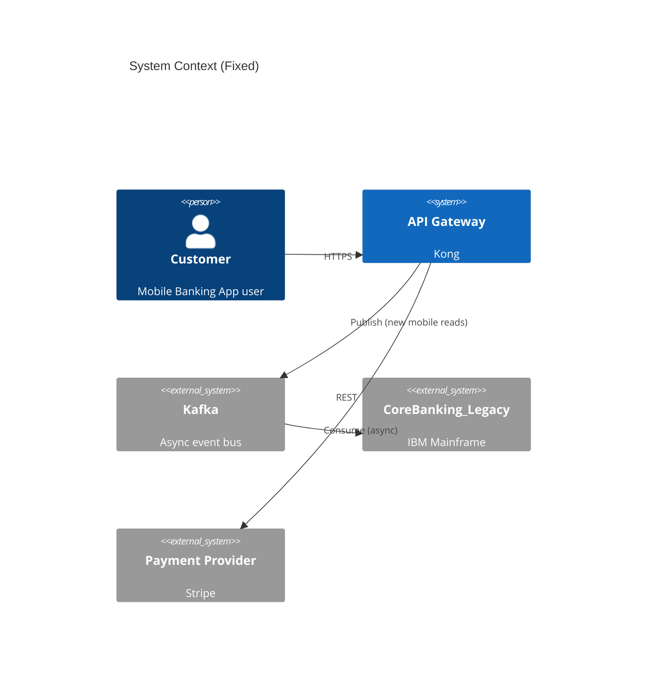

An agent gets a straightforward ticket: "Display the available overdraft limit on the mobile banking dashboard." It does what any good engineer would — it looks for existing patterns. It explores the AccountOrchestration API, spots dozens of existing synchronous REST calls to the CoreBanking_Legacy endpoint, and replicates the pattern to fetch the overdraft data. The code is clean, the unit tests pass, and the agent opens a Pull Request.

Twenty minutes later, a senior engineer rejects it.

What the agent never knew — because it wasn't written anywhere in the code — is that the legacy core banking API cannot handle the mobile app's peak traffic volume. The architecture board decided three months ago that all new mobile read-requests must route through the new asynchronous caching layer. The agent didn't fail. It optimized for what was explicit: the most prevalent orchestration pattern in the repository. But in the absence of architectural context, the agent's speed just generated technical debt that a human reviewer had to catch.

This happens whenever throughput, compliance, or architecture lives only in meetings and chat, while the repo stays the only artifact the agent can trust. Agentic coding scales output. If the only legible context is the repository, it also scales misalignment. Agents optimize for what is explicit. What is intended is invisible to them.

The instinctive industry response is Spec-Driven Development — shifting the source of truth away from code into natural-language specifications, and letting agents generate the implementation.

The appeal is understandable: if agents lack intent, give them a document that captures intent and make that document the source of truth. The problem is that this conflates two different things.

The distinction that matters is between Code as Truth of State (what the system actually does) and Documentation as Truth of Intent (what it is allowed to do). The agent in this scenario had perfect knowledge of the first and none of the second.

---

## The Source of Truth Is Source Code

Code is the only thing that executes. Tests validate its behavior. Deployment confirms it. No document can contradict what the machine does. When a specification says one thing and the code does another, the specification is stale. The code runs.

This is a technical position, not a philosophical one. A spec cannot be compiled, tested, or deployed. A diagram cannot have a bug. The moment any artifact other than the code is treated as authoritative, you introduce a synchronization problem you can never fully close.

Spec-Driven Development misunderstands this. Tools like [Kiro](https://aws.amazon.com/documentation-overview/kiro/), [spec-kit](https://github.github.com/spec-kit/), and [Tessl](https://tessl.io) propose that specifications become the primary artifact — that code is generated *from* the spec, and that the spec is what you change when the system needs to change.

The parallel to Model-Driven Architecture is instructive. MDA made the same argument two decades ago, with similar promises about abstraction and generation.[^1][^2] The approaches differ in important ways. MDA used formal DSLs and deterministic transformations; SDD uses natural language and non-deterministic LLMs. SDD is more iterative, allowing refinement rather than requiring complete specifications upfront. Tools like Tessl attempt to make the specification formally verifiable or executable, which partially addresses the synchronization problem MDA never solved.

Both share the same foundational bet: that shifting complexity into a less precise medium eliminates it rather than relocating it. That bet has not paid off yet at scale, in either generation. Natural language is less precise than code. And unlike MDA's deterministic compiler, SDD's LLM-based generation introduces a new kind of unpredictability that MDA never had to account for.

Beyond the technical problem is a structural one. SDD specs start at the feature level — they describe *what* to build, not *why*. Without anchoring to business objectives, OKRs, or architectural constraints, agents generate technically correct but strategically irrelevant code. When Birgitta Böckeler evaluated Kiro for a trivial, isolated bug fix, the tool generated four user stories with sixteen acceptance criteria.[^2] A sledgehammer for a nail. Because the spec doesn't know why the feature matters, neither does the agent. The result is reactive engineering — significant development capacity spent on features whose value was never validated.

This is the point where the argument could stop — and where most of the SDD debate does stop, with one side insisting code is all that matters and the other insisting specs must govern. Both positions miss the same thing. Code is authoritative about what the system does. That authority does not extend to explaining why it does it, what it is forbidden from doing, or what constraints shaped it.

Recognizing code as the source of truth is not the same as claiming code is self-explanatory. Code tells you what the system does. It does not tell you why decisions were made, what constraints apply, or what the architecture forbids. Those are distinct claims — and conflating them is what SDD exploits. The problem is that code is a poor map of its own context. Expecting an agent to derive system architecture purely from source code is like expecting a database to perform a complex query without an index: it forces a massive, expensive full-table scan of the entire repository. The agent must search and pattern-match across the codebase just to discover what the system considers "normal."

---

## What Documentation Still Must Do

Code is the only artifact that executes. That is a technical claim, not one about readability. But parsing this absolute truth from scratch every time is fundamentally too expensive — for humans and for agents.

An agent working on module A doesn't need to read module B's 3,000 lines of implementation. It needs to know what module B exports, what invariants it maintains, what it depends on — and then decide whether to dig deeper. This is the same principle as API documentation for humans. The economics are sharper for agents: every unnecessary token costs compute and increases hallucination risk. Documentation becomes a navigation layer above the codebase, letting agents traverse it without reading it whole.[^3]

Without this layer, every agent session begins the same way: reverse-engineering the system from source. Expensive in tokens, error-prone in practice, and repeated identically in every session. A small amount of targeted documentation can eliminate large amounts of repeated repository scanning.

Four things specifically cannot be inferred from code.

**Product context.** Code can tell you how a system works. It cannot tell you why the system exists, who the users are, which external APIs carry SLAs, or which business rules must never be violated. The agent in the opening scenario failed here. The microservice boundary rule (from the introduction example) existed nowhere in the repository because no documentation brought it in, the agent had no way to encounter it.

**Decisions and rationale.** Code shows what was chosen. Architecture Decision Records capture what was rejected and why.[^4] An agent proposing a solution that was already evaluated and ruled out two years ago has no way to know that — unless the decision was recorded. In agentic systems, ADRs gain dimensions the conventional format never anticipated: base model selection, context window constraints, fallback strategies when the model declines a task, drift tolerance thresholds.

**Interface contracts.** Between modules, between services, between teams. Code implements contracts; it doesn't always declare them. A module's public API is part of its implementation, but its invariants — what it guarantees it will never do, what callers must never assume — are often not. These need to be explicit, or agents will infer them from behavior they happen to observe in the current context.

**Architecture boundaries.** Traditional documentation assumes deterministic components with stable interfaces. Agent-based systems have probabilistic boundaries: where LLM output is non-deterministic, where data distribution shifts change behavior without code changes, where ML model lifecycles run asynchronously to the surrounding infrastructure. An agent working across these boundaries needs to know where deterministic behavior ends and where it must account for uncertainty. Documentation is the only way to make that visible.[^5]

This is documentation as precision, not compliance requirements. The difference between an agent that guesses and one that knows what it's not allowed to guess. The four categories above are the context an agent needs — what it cannot infer from code alone, and what prevents it from resolving ambiguity by guessing. The agent in the opening scenario guessed. It guessed correctly by every measure available to it. The cost wasn't from a bad guess — it was from a question the agent had no way to ask.

---

## What Breaks When Documentation Is Absent

That question becomes structural when you consider how agents operate across time. Every agent session starts fresh. The model has no memory between calls — no residual understanding of past decisions, no accumulated context from previous sessions. Documentation is the only mechanism that bridges the gap. Without it, multi-session workflows degenerate into repeated rediscovery: the agent reconstructs the same understanding from source code, session after session, at full token cost each time.

This is the root cause of agent drift. Without documentation anchoring context, agents build their own implicit model of the system. These models diverge across sessions. Deprecated code structures that persist as technical debt become de facto patterns — the agent has no way to know it should not follow them. Two agents working in parallel on the same codebase can produce conflicting architectures because they each inferred a different starting model from the same repository.[^6]

Documentation that exists but isn't maintained is another failure mode, distinct from absence. An agent reads stale documentation, trusts it, and generates code against it. The codebase now carries the original drift plus the new code built on top of it. Unlike a failing test, stale documentation gives no signal. It produces confident, coherent, wrong output.

These are operational failures. They also have a second-order consequence that matters in regulated industries: what can't be traced can't be audited. Undocumented decisions are unauditable decisions. Under the EU AI Act (Annex IV, enforceable August 2026), organizations must provide systematic evidence of AI system design choices, risk controls, and governance structures. Traditional architecture documentation covers roughly 36% of what that regulation requires.[^5] The rest lives in decisions made verbally and never written down. For organizations operating under regulatory scrutiny, absent documentation is not a technical debt problem — it is a legal one.

Absence is one failure mode. Presence creates another. Documentation that exists but contradicts the code introduces a different kind of risk — and it is the one that surfaces when you take the previous sections seriously and actually add documentation to the repository.

---

## When Code and Documentation Conflict

Treating documentation as essential context while maintaining that code is the source of truth creates a tension. When the two disagree, which does the agent follow?

The answer depends on what kind of claim is in conflict. Code and documentation are not competing sources of truth for the same thing — they answer different questions. Code is authoritative about *behavior*: what the system actually does when it runs. Documentation is authoritative about *intent and constraints*: what the system is supposed to do, and what it must never do. These are distinct domains. When they conflict, it does not mean one outranks the other — it means one of them is wrong, and a human needs to decide which.

This distinction resolves most cases cleanly. If the documentation says "no synchronous calls to CoreBanking_Legacy" and the agent finds synchronous calls in the codebase, the code is not evidence that the constraint is wrong — the code is evidence that the constraint was violated, or that the code predates the decision. The agent follows the documented constraint and flags the discrepancy. If the documentation describes a module interface that no longer matches the implementation, the documentation is stale — the code is what actually executes. The agent surfaces the mismatch.

What the agent cannot do is determine *why* the conflict exists. A documentation constraint that contradicts the code could mean the code has a bug, the code reflects a decision that was never documented, or the documentation was written for a system state that no longer exists. These are epistemically indistinguishable from the agent's position. An agent that resolves this ambiguity by guessing — in either direction — is making an architectural decision it is not qualified to make. The correct behavior is to surface the conflict and stop: human-in-the-loop, not agent judgment.

The practical implication is that prevention matters more than resolution. The resolution mechanism for conflicts is "human in the loop"; the mechanism for preventing conflicts is the PR. Documentation that lives in the repository ships in the same commit as the code it describes, which means divergence is a reviewable artifact, not a silent background process. The human reviewer is the synchronization check: the agent flags explicit contradictions it encounters during a session, and the reviewer catches what the agent missed at merge time. This does not eliminate the divergence problem — documentation written for a previous system state can survive many PRs undetected if nobody touches the relevant files. But it makes divergence structurally visible rather than structurally invisible, which is the most the tooling can do. I consider that correct, not a gap.

---

## What Good Documentation Looks Like for Agents

Documentation makes code legible, prevents drift, and carries intent. The question is what form it should take. The wrong choice compounds the problem it is meant to solve. Most documentation frameworks are designed for human readers — and agents aren't human readers. Humans tolerate ambiguity, infer intent, and navigate to what's relevant. Agents parse what's present, act on what they find, and treat gaps as permission to guess. Documentation for agents needs different properties.

**Machine-readable first, human-readable second.** Agents parse structure. Consistent headings, predictable file locations, and explicit cross-references matter more than prose elegance. An agent that knows documentation lives at `docs/architecture/decisions/` navigates there directly. One that must search for it will search the entire repository — or skip it entirely. Format is not an aesthetic choice, it is a navigability constraint.

**Concise over comprehensive.** Every token loaded into the context window displaces other context. A 200-token index that identifies what exists and where to find it is more valuable than a 2,000-token document where critical constraints get lost in the noise. The principle is Progressive Disclosure: a lightweight summary first, with pointers to deeper files the agent loads only when the task requires it. This keeps context usage predictable and hallucination risk low.

**Living, not archival.** The old criticism of documentation — it's always out of date — becomes a system failure in agentic coding. If documentation drifts from the codebase, agents generate code against stale assumptions. The fix is to make the agent the maintainer: the workflow must enforce that documentation is updated alongside the implementation — not as a parallel task, but as the same commit. The core loop is non-negotiable: read the relevant context before acting, update the architectural rules and system patterns after acting. Code and documentation ship together or not at all. I've described this workflow in detail in my [reevaluation of spec-kit](https://markus.wondrax.cloud/articles/spec-kit-reevaluation.html), including the failure modes when the update step is skipped.

**Layered by function, not audience.** Effective documentation physically separates context into different files based on exactly when the agent needs them:

*   **Global Constraints (Always-on):** A single root file (like `AGENT.md`) containing hard prohibitions and project-wide conventions. This is the only file the agent is required to load in every single session.
*   **Domain-Specific Context (Task-specific):** Deep-dive architectural rules or module boundaries live in separate files (e.g., `docs/auth-service.md`). The agent is instructed to load these *only* when touching related code, keeping token consumption at zero otherwise.
*   **Tooling Over Text (Live data):** Documentation should never harbor rapidly changing state. Instead of maintaining a stale database schema in a text file, the documentation explicitly instructs the agent which CLI command to run to fetch the live schema at runtime.
*   **The Memory Bank (Persistent context):** To survive the amnesia between isolated sessions, projects need a structured, agent-maintained file (like `docs/active-context.md`). This acts as a persistent log where the agent records ongoing decisions and progress, bridging the gap between sessions.

Each layer has a distinct function; conflating them into a single document produces an artifact that is too massive to load precisely and too diffuse to be useful. **Layered by function, not audience.**

Agents will misunderstand any instruction that admits misinterpretation — consistently, at scale, across every session. Documentation must be written to survive deliberate misreading: explicit, simple, bordering on pedantic. Rules must include their rationale. "Use tabs" is a rule. "Use tabs because this is a Python project and the formatter enforces it" is a rule the agent can apply correctly even in edge cases. LLMs comply at significantly higher rates when they understand the reasoning behind a convention.[^7] Idioms, nuance, and implied exceptions are failure vectors. 

Rules constrain. Examples teach. A documentation system needs both.

A well-structured documentation set also includes a Gold Standard File: a single, perfectly formatted source file that serves as the absolute reference for all generation. Paired with explicit correct-versus-incorrect comparisons, it tells the agent what not to replicate. Agents learn through pattern recognition. Providing the correct patterns explicitly is faster and more reliable than expecting agents to infer them from a heterogeneous codebase.[^7]

---

## Architecture Documentation Must Evolve — and arc42 Already Shows You How

These properties don't require a new framework. The instinct to invent one is understandable. The more useful question is which requirements are already solved and where the gap begins.

Arc42 answers the first part. It is a structured, view-based documentation template that has been in production use for over a decade. Its twelve sections map to distinct concerns — context, constraints, building block structure, runtime behavior, deployment, cross-cutting concepts, decisions — and that separation of concerns is precisely what agent documentation needs: concerns separated into distinct, locatable places, not collapsed into undifferentiated prose. C4 contributes a complementary discipline: a strict four-level hierarchy (System, Container, Component, Code) that gives an agent a predictable traversal path. An agent can enter at the System level, descend exactly as far as the task requires, and stop — rather than scanning a flat, undifferentiated repository.

Neither framework was designed for agentic coding. Both happen to be well-suited to it for the same reason they serve human readers: they make architecture navigable without requiring a full read.

---

### From Framework to Files: arc42 as Source Code Artifacts

The gap between "arc42 exists" and "an agent can use it" is a question of where the documentation lives and how it is rendered. Most teams that use arc42 at all maintain it in Confluence, a shared wiki, or a PDF. All three are inaccessible to an agent working in a code repository. The adjustment is not structural — it is operational.

**The documentation belongs in the repository, as Markdown files, alongside the code it describes.**

External documentation systems can be made accessible to agents through MCP (Model Context Protocol) servers. This is a viable architecture if the MCP implementation provides hierarchical, precise access — semantic search, proper chunking, and scoped retrieval rather than flat document dumps. However, this introduces operational complexity: the MCP server becomes another component to maintain, configure, and keep in sync with the code.

In-repo documentation sidesteps this entirely. The agent reads and updates docs using the same file operations it uses for code. The git history captures both together. The barrier to adoption is zero — no additional tooling, no server configuration, no dependency on MCP support in the agent system. It follows directly from the principle established earlier: if code is the source of truth, the context layer that makes code legible should live in the same place, maintained by the same workflow.

The rendering implication matters as much as the location. Architecture diagrams embedded as PNGs or SVGs are expensive context — they require vision processing rather than text parsing, and they cannot be updated without external tooling. Mermaid.js closes this gap. Diagrams as plain text let agents parse system topology, reason about component relationships, and generate or update diagrams without any image-processing overhead. Every diagram in the documentation should be a Mermaid block, not an image embed.

---

### The Three-Tier Loading Model

Not all arc42 sections are equally useful to an agent, and loading them indiscriminately defeats the purpose. The same progressive disclosure principle that governs documentation structure governs how documentation is loaded: a small amount of targeted context first, deeper content only when the task requires it.

The twelve arc42 sections divide into three operational tiers based on two criteria: how often the agent needs them, and how expensive it is to load them unnecessarily.

**Tier 1 — Always-on.** These sections are short, stable, and define what the agent must not do. They belong in `AGENTS.md` itself — not as full content, but as explicit rules with their rationale.

- **§2 — Constraints** is the most directly useful section for agentic coding. Hard prohibitions — the architectural rules the agent must never violate — live here. "No synchronous calls to CoreBanking\_Legacy for new mobile reads" is a constraint. It belongs in Tier 1 because it applies universally and the cost of missing it is the scenario from the opening paragraph.
- **§1 — Introduction & Goals** contributes the top three quality objectives: performance, compliance, availability. Not the full stakeholder analysis — just the non-negotiables.
- **§12 — Glossary** prevents the agent from treating domain synonyms as interchangeable. In a banking system, "OverdraftLimit" and "CreditLine" are not the same concept. A misidentification here propagates into every query, every variable name, every API call.

**Tier 2 — On-demand.** These sections are too large and too specific for the global context, but critical when the agent touches the relevant code area. The trigger is the code the agent is working in, not the task description.

- **§3 — Context & Scope** answers: what external systems exist, what do they promise, what are the interface contracts? Load it when the agent touches an external API call, an integration layer, or an event topic.
- **§5 — Building Block View** is the structural index of the system: modules, components, their responsibilities, their dependencies. Load it when the agent creates a new component, refactors a module boundary, or encounters an unfamiliar directory.
- **§6 — Runtime View** contains sequence diagrams of the critical flows across module boundaries. Load it when the agent is implementing a cross-module flow or debugging an interaction problem — not for self-contained feature tickets.
- **§7 — Deployment View** maps infrastructure to environments. Load it when the agent touches configuration, infrastructure-as-code, CI/CD, or environment-specific logic.
- **§8 — Crosscutting Concepts** is the Golden Path section: the patterns that apply everywhere — security, logging, error handling, authentication. Load it when the agent writes a new service, implements auth, or adds observability. This is where the reference implementation lives.
- **§9 — Architecture Decisions (ADRs)** capture what was rejected and why. An ADR index stays in the always-available context; individual records are loaded when the agent is choosing between technical options or encounters a pattern that seems inconsistent with what it has seen elsewhere.

**Tier 3 — Reference only.** These sections have high value for human stakeholders and low operational value for the agent in a typical task.

- **§4 — Solution Strategy** is too abstract for task-specific context. Useful for onboarding; not useful as a loaded constraint.
- **§10 — Quality Requirements** matters only insofar as it produces concrete, testable non-functional requirements. If it does, those requirements belong in §2 (Constraints, Tier 1). Abstract quality trees do not.
- **§11 — Risks & Technical Debt** is the exception that proves the rule. Standard arc42 has no machine-readable format for this section — it is prose, and prose technical debt registers produce no operational signal. The correct approach here is an AI Debt Register: a structured list of patterns present in the codebase that are known technical debt and must not be replicated by the next agent session. A pointer to this register belongs in Tier 1. The full content is Tier 3.

What to load is half the problem. The other half is where it applies.

---

### Nested Inheritance: Constraints That Know Their Scope

A constraint that applies to the backend service is not a constraint that should consume context in a frontend session. This is the practical problem that flat `AGENTS.md` files do not solve well — and it is solved by the nested inheritance model that the AGENTS.md specification already supports.

The objection to repository-level context files is legitimate. Gloaguen et al. (2026) found that they reduce task success rates and increase inference costs by more than 20%.[^8] This is a real finding, not an edge case, and the approach this article recommends would reproduce that failure if implemented naively — a single monolithic context file dumped into every session regardless of what the agent is doing. The nested model is a direct response to this failure mode. The agent loads the `AGENTS.md` file closest to the file it is editing. In a monorepo with `packages/api/` and `packages/frontend/`, a backend ticket automatically loads the backend-specific constraint file; a frontend ticket loads the frontend-specific one. Backend constraints are not loaded for frontend work. The Gloaguen et al. finding is an argument against undiscriminated context loading — not against structured, scoped documentation.

Whether nested scoping outperforms simpler alternatives in practice, I don't know yet. The logic is sound; the evidence base is the Gloaguen et al. result plus the structural argument, not a controlled trial.

The structure works at two levels: a root `AGENTS.md` for universal constraints, and nested `AGENTS.md` files for domain-specific ones. Universal constraints — architectural invariants that apply regardless of where the agent is working — live at the root. Domain constraints — rules that apply only to the API layer, or only to the frontend, or only to infrastructure code — live in the corresponding subdirectory.

---

### The Concrete File Structure

The following layout maps the three-tier model onto a repository. It is the arc42 documentation structure made agent-accessible.

```
/
├── AGENTS.md                           # Tier 1a: Universal
│   ├── Setup commands
│   ├── Universal Constraints (§2)
│   ├── Top-3 Quality Goals (§1)
│   ├── Pointer → docs/glossary.md (§12)
│   └── Pointer → docs/architecture/README.md
│
├── packages/
│   ├── api/
│   │   ├── AGENTS.md                   # Tier 1b: Backend constraints only
│   │   └── src/
│   └── frontend/
│       ├── AGENTS.md                   # Tier 1b: Frontend constraints only
│       └── src/
│
└── docs/
    ├── architecture/
    │   ├── README.md                   # Pointer index (~200 tokens)
    │   ├── context-scope.md            # §3 — Context & Scope
    │   ├── building-blocks.md          # §5 — Building Block View
    │   ├── runtime.md                  # §6 — Runtime View
    │   ├── deployment.md               # §7 — Deployment View
    │   ├── patterns.md                 # §8 — Crosscutting Concepts
    │   ├── strategy.md                 # §4 — Solution Strategy (Tier 3)
    │   ├── quality.md                  # §10 — Quality Requirements (Tier 3)
    │   └── risks.md                    # §11 — AI Debt Register (Tier 3)
    ├── decisions/
    │   ├── README.md                   # ADR index (~200 tokens)
    │   ├── 001-async-mobile-reads.md
    │   ├── 002-saga-pattern.md
    │   └── ...
    └── glossary.md                     # §12 — Glossary
```

The root `AGENTS.md` is the only file loaded in every session. It contains universal constraints as explicit rules, the top three quality objectives, and pointers — not content — to the deeper documentation. An agent working on a backend ticket also loads `packages/api/AGENTS.md`. An agent working on a frontend component loads `packages/frontend/AGENTS.md`. Neither loads the other.

---

### What the Files Actually Contain

The content in each tier follows the same principle: explicit rules with their rationale, not prose description.

The root `AGENTS.md` for the system from the opening scenario would contain:

```markdown
## Constraints (Universal)

- **No synchronous calls to CoreBanking_Legacy for new mobile reads.**
  Reason: The legacy endpoint cannot handle mobile peak traffic (ADR-001).
  All new mobile read operations must route through the async caching layer via Kafka.

- **All API endpoints require rate limiting.**
  Reason: EU AI Act Annex IV compliance requirement (docs/quality.md).

- **No cross-service direct database access.**
  Reason: Microservice boundary invariant (docs/architecture/building-blocks.md).
  Every service reads and writes only its own database.

## Top-3 Quality Goals

1. **Performance:** Response time < 200ms for all mobile endpoints (P95)
2. **Compliance:** EU AI Act Annex IV (high-risk components documented)
3. **Availability:** 99.9% for all customer-facing services

## Documentation Index

Full architecture documentation: docs/architecture/README.md
Glossary: docs/glossary.md
ADRs: docs/decisions/README.md
```

The architecture index (`docs/architecture/README.md`) functions as the entry point for Tier 2 content:

```markdown
# Architecture Documentation

Load the relevant section when your task touches the corresponding code area.

| Section | File | Load when |
|---|---|---|
| Context & Scope | context-scope.md | External API calls, event topics |
| Building Blocks | building-blocks.md | New component, module refactor |
| Runtime | runtime.md | Cross-module flows, interaction debugging |
| Deployment | deployment.md | Config, IaC, CI/CD, env-specific logic |
| Patterns | patterns.md | New service, auth, logging, error handling |
| ADR Index | ../decisions/README.md | Technical choice, pattern inconsistency |
```

The context and scope file contains the system boundary diagram as a Mermaid block, not an image:



And a crosscutting concepts file (`patterns.md`) contains the Gold Standard implementation the agent should replicate — not describe in prose, but show in code:

```typescript
// Gold Standard: Service method with structured logging and error handling
// This is the reference implementation. Replicate this pattern for all new service methods.

async function getAccountBalance(accountId: string): Promise<AccountBalance> {
  const log = logger.child({ accountId, operation: 'getAccountBalance' });
  log.info('Fetching balance');

  try {
    const result = await balanceCache.get(accountId);
    log.info({ cached: true }, 'Balance retrieved');
    return result;
  } catch (error) {
    log.error({ error }, 'Balance fetch failed');
    throw new ServiceError('BALANCE_FETCH_FAILED', { accountId });
  }
}
```

---

### The Genuine Gap: AI-Specific Vocabulary

Arc42 as described above covers what any system needs documented. The gap for AI-augmented teams is in vocabulary, not structure. Arc42 has no slot for the decisions that appear specifically in agentic systems: which base model was selected for a component and why, what the context window constraint is, what happens when the model declines a task, how much drift the surrounding system can tolerate before the component needs retraining.

These decisions are being made in every team adopting agentic workflows right now. Most of them are going unrecorded. The RAD-AI framework extends arc42 with eight sections to close this gap — and does so backward-compatibly, meaning existing arc42 documentation does not need to be restructured.[^5]

Section §11, in the RAD-AI extension, becomes the AI Debt Register: not prose observations about technical debt, but a structured list of patterns present in the codebase that are known debt and must not be replicated by the next agent session. The agent reads this register on every session start. It prevents the specific failure mode where an agent treats existing bad code as a precedent worth following.

The ADR format gains seven new fields for AI components: base model, context window size and strategy, output format specification, fallback behavior when the model is unavailable or declines, drift tolerance thresholds, monitoring approach, and human-in-the-loop criteria. These are operational requirements for any system that relies on non-deterministic components, and any team operating without them is accruing decision debt at the same rate they are accruing code.

That is the full picture. Arc42 provides the structure, the three-tier model handles loading, nested inheritance handles scoping, and RAD-AI fills the vocabulary gap for AI-specific decisions. The question is whether it works.

---

### What This Changes in Practice

The scenario from the opening section has a different outcome if this structure is in place. The agent picks up the ticket, loads the root `AGENTS.md`, and reads the first constraint under §2: no synchronous calls to CoreBanking\_Legacy for new mobile reads. It loads the architecture index, sees that the building blocks file is relevant, and reads the async caching layer interface contract. It writes the implementation against the correct pattern, references ADR-001 in its commit message, and opens a Pull Request that passes review. (This is hypothetical — the same system, played forward with the documentation in place.)

What the research does support is narrower and more specific. Gloaguen et al. (2026) found that AGENTS.md files have a measurable positive effect when they contain explicit, task-relevant constraints — and a measurable negative effect when they don't, producing context bloat that actively degrades performance.[^8] The three-tier loading model is a direct structural response to that finding: global constraints only at the root, domain context loaded only when the task touches the relevant code area, reference material never loaded automatically. Whether that structure produces the outcome described above in practice depends on how well the documentation is written and maintained — a variable the model cannot control for.

The documentation didn't make the agent smarter. It gave the agent the context it needed to apply what it already knows to the specific constraints of this system. That is a different claim, and a more tractable one.

---

## Conclusion

The instinct when facing a new problem is to reach for a new tool. Agentic coding feels new enough to justify that instinct, and the market has obliged with frameworks, specification formats, and context management systems designed for it.

Most of that complexity is unnecessary. The problem is not that we lack the right documentation framework. Arc42 has been solving the structural problem for over a decade: concerns separated into distinct, locatable places, navigable without a full read. The problem is that the documentation lives in the wrong place — in Confluence, in a wiki, in a PDF that no agent will ever open. Moving it into the repository, as Markdown files, alongside the code it describes, is a habit change, not a technical challenge.

The wheel does not need reinventing. It needs moving.

What agents need from documentation is what human engineers need: constraints they must not violate, decisions that were already made and why, interfaces they can rely on without reading the implementation. Arc42 already has slots for all of it. The three-tier loading model reads what was already there with agent economics in mind.

The gap is vocabulary. Agentic systems introduce decisions that no existing framework anticipated: base model selection, context window constraints, drift tolerance thresholds, fallback behavior when the model declines. These need to be recorded somewhere, and arc42 has no native slot for them. The RAD-AI extension closes that gap backward-compatibly. Everything else is already there.

Source code remains the source of truth. Documentation remains the map that makes it navigable. Neither of those claims is new. What's changed is the cost of ignoring the second one — and the good news is that the tools to act on it have been available for years.

---

[^1]: Paul Preiss, "Spec-Driven Development is Better With Core Architecture," Architecture & Governance, April 2026. <https://www.architectureandgovernance.com/applications-technology/spec-driven-development-is-better-with-core-architecture/>
[^2]: Birgitta Böckeler, "Understanding Spec-Driven-Development: Kiro, spec-kit, and Tessl," martinfowler.com, October 2025. <https://martinfowler.com/articles/exploring-gen-ai/sdd-3-tools.html>
[^3]: Cline, "Memory Bank," docs.cline.bot. <https://docs.cline.bot/features/memory-bank>
[^4]: Michael Nygard, "Documenting Architecture Decisions," Cognitect, 2011; Joel Parker Henderson, "Architecture decision record," GitHub repository. <https://cognitect.com/blog/2011/11/15/documenting-architecture-decisions> <https://github.com/joelparkerhenderson/architecture-decision-record>
[^5]: Oliver Aleksander Larsen and Mahyar T. Moghaddam, "RAD-AI: Rethinking Architecture Documentation for AI-Augmented Ecosystems," arXiv, 2026; companion repository. <https://arxiv.org/abs/2603.28735> <https://github.com/Oliver1703dk/RAD-AI>
[^6]: TeamDay.ai, "The Complete Guide to Agentic Coding in 2026," 2026. <https://www.teamday.ai/blog/complete-guide-agentic-coding-2026>
[^7]: Stack Overflow Blog, "Building shared coding guidelines for AI (and people too)," March 2026. <https://stackoverflow.blog/2026/03/26/coding-guidelines-for-ai-agents-and-people-too/>
[^8]: Thibaud Gloaguen et al., "Evaluating AGENTS.md: Are Repository-Level Context Files Helpful for Coding Agents?" arXiv, February 2026. <https://arxiv.org/abs/2602.11988>
